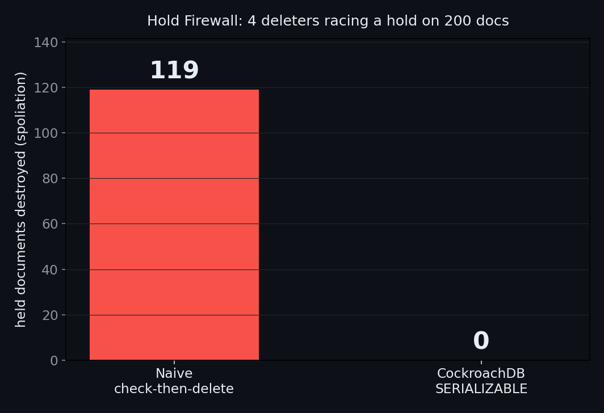

# Dynamic Hold Firewall — a real-time spoliation guard

**Nota.Lawyer suite · CockroachDB × AWS "Build with Agentic Memory"**

The instant a litigation hold triggers, an agent must lock down responsive
documents **while employees and automated retention/cron jobs are still
deleting data.** That is a concurrency problem, and getting it wrong destroys
evidence — spoliation, and a sanctionable one. CockroachDB's `SERIALIZABLE`
isolation makes the hold a bulletproof, legally defensible snapshot.

> **Metadata is not documentation. It is evidence — so don't let it be deleted.**

---

## The result

4 retention/cron deleters purge non-held documents while the hold agent places
a hold on 200 responsive documents — all at once, against the live cluster.
The invariant: **a held document must never be deleted.**

| Isolation | Held documents destroyed |
|---|---|
| Naive check-then-delete | **119** (spoliation) |
| **CockroachDB SERIALIZABLE** | **0** |



Between a deleter checking "is this on hold?" and performing the delete, the
hold lands — and a naive read-then-write deletes it anyway. Over a hundred
held documents gone. Under `SERIALIZABLE`, that exact race is *detected*: the
deleter's transaction conflicts with the hold write, retries, re-reads, sees
the hold, and backs off. **Zero** evidence lost. (Raw run:
[`docs/spoliation_proof.txt`](docs/spoliation_proof.txt); the naive count
varies run-to-run — it is always large, and SERIALIZABLE is always zero.)

## Why this is the CockroachDB story, not a vector-store story

A vector database can tell you *which* documents are responsive. It cannot stop
a concurrent process from deleting one while you're placing the hold. This
agent's "memory" is a **transactional system of record** whose defining feature
is exactly what a hold needs:

- **Strict SERIALIZABLE isolation** — the check-and-delete is atomic against
  the hold-placement write. No write skew, no phantom, no lost update. The race
  that destroys evidence under weaker isolation simply cannot commit.
- **A defensible audit trail** — every hold and every attempted delete is a
  committed, timestamped transaction. When opposing counsel alleges spoliation,
  the transaction log *is* the proof of what was held, when, and that nothing
  slipped through.
- **Survives node loss** — the hold state is distributed and consensus-backed;
  killing a node loses zero holds.

This is the property the whole Nota.Lawyer suite quietly depends on — Cold
Case, Ledger, Witness and Gap Hunter all write shared case memory concurrently.
Hold Firewall makes that guarantee the *product*.

## Run

```
py -3.11 src/hold_firewall.py [num_docs] [num_deleters]   # default 200 4
py -3.11 src/chart.py                                     # docs/spoliation.png
```

Each run resets state, races the deleters against the hold agent in both
isolation modes, and reports held-documents-destroyed. Requires only
`CRDB_ADMIN_URL`; no GPU.

## Status

Built and verified against the live CockroachDB cluster: concurrent hold-vs-
delete harness, spoliation measurement (≈100+ vs 0), captured proof, chart.
Next: wire the hold agent to Cold Case's responsiveness classifier so holds are
placed on *semantically* responsive docs, not a flag.

MIT licensed. Part of the Nota.Lawyer suite: Cold Case · Ledger · Witness ·
Gap Hunter · Hold Firewall — one CockroachDB memory backbone, five legal agents.
